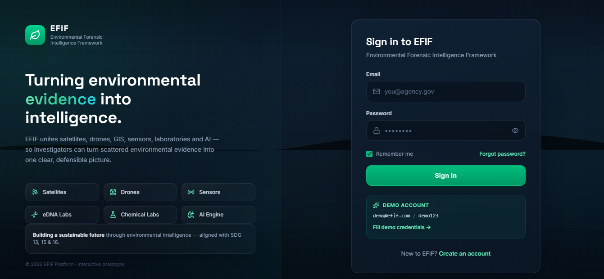

# EFIF — Environmental Forensic Intelligence Framework

A high-fidelity **interactive prototype** of a future environmental digital-forensics command
center. EFIF brings together satellites, drones, GIS, environmental sensors, chemical
laboratories, eDNA and AI — and helps investigators turn scattered environmental evidence
into one clear, defensible picture.

> **Prototype only.** All data is mock, all integrations are simulated, and there is no
> backend or database. It is designed to look and feel like a serious environmental
> technology product, not to perform real analysis.


## Getting started

```bash
npm install
npm run dev
```

Open the printed URL (default http://localhost:5173).

### Demo account

| Field    | Value          |
| -------- | -------------- |
| Email    | `demo@efif.com` |
| Password | `demo123`      |

You can also register a new account — it is stored locally (localStorage) so you can sign
in with it immediately after.


## What's inside

  handling and simulated latency. Structured so a real backend can replace it
  (`src/lib/auth.ts` is the single seam: swap `authenticate`, `createAccount` and the
  session helpers for real API calls).
  - 5 animated KPI cards with counters and sparklines
  - Custom SVG incident map (river network, protected area, roads) with zoom, layer
    toggle, legend and clickable risk markers
  - Featured incident card (EFIF-0017) with animated AI risk gauge (87/100 · HIGH),
    contributor bars, and working quick actions
  - Six evidence cards that open chain-of-custody detail modals (with Recharts
    laboratory/historical charts)
  - Recent alerts (with detail modal), staggered investigation timeline, platform
    integration grid (Satellite · Drone · eDNA Lab · Sensors · AI · GIS)
  Evidence Vault, Data Sources, Analytics & AI, Reports, Alerts, Users & Roles, Settings)
  all rendered locally (no external map or image dependencies)

## Tech stack

React 19 · TypeScript · Vite · Tailwind CSS v4 · React Router 7 · Framer Motion ·
Lucide React · Recharts

## Structure

```
src/
├── components/
│   ├── layout/        # Shell, TopBar, Sidebar, background FX, SDG panel
│   ├── dashboard/     # KPI, map, incident, gauge, evidence, alerts, timeline, modals
│   ├── auth/          # AuthShell (shared login/register frame)
│   └── ui/            # GlassCard, Button, Badge, Modal, Icon, counters, toasts…
├── pages/             # Login, Register, Dashboard, Placeholder
├── data/mock.ts       # All mock data (kept separate from UI)
├── types/             # Shared types
├── hooks/             # usePersistentState, useClickOutside
├── context/           # Auth, Toast, Search providers
└── lib/auth.ts        # Mock auth service (backend-swappable)
```

## Scripts

| Command              | Purpose                     |
| -------------------- | --------------------------- |
| `npm run dev`        | Start the Vite dev server   |
| `npm run build`      | Type-check and build        |
| `npm run typecheck`  | TypeScript check only       |
| `npm run preview`    | Serve the production build  |
 # EFIF - Environmental Forensic Intelligence Framework

 EFIF is a high-fidelity React prototype for an environmental forensic intelligence command center. It presents mock satellite, drone, GIS, sensor, laboratory, eDNA, and AI evidence in a unified investigation dashboard.

 > This is an interactive frontend prototype. It uses simulated data and local browser storage; it does not perform real environmental analysis or connect to a production backend.

 ## Features

 - Login and registration flows with client-side validation, loading states, and simulated latency.
 - Demo account support and locally persisted sessions and registered users.
 - Responsive command dashboard for the Bengaluru operational theatre.
 - Animated KPI cards for incidents, investigations, evidence, alerts, and resolved cases.
 - Self-contained SVG incident map with risk markers, zoom, labels, legend, and recenter controls.
 - Featured incident view for case `EFIF-0017`, including an animated composite risk score of `87/100`.
 - Evidence summary with six evidence types, chain-of-custody details, and Recharts laboratory or historical charts.
 - Recent alert list with filtering, detail modals, and client-side acknowledgment state.
 - Global search across the dashboard evidence and alert data.
 - Notifications dropdown, profile menu, logout, toast messages, and responsive collapsible navigation.
 - Simulated add-evidence, report-generation, download, and case-sharing interactions.
 - Coming-soon routes for the planned Incidents, Map & GIS, Evidence Vault, Data Sources, Analytics & AI, Reports, Alerts, Users & Roles, and Settings modules.

 ## Tech Stack

 ### Frontend

 - React 19
 - TypeScript with strict compiler settings
 - Vite 8
 - Tailwind CSS v4
 - React Router 7

 ### Backend

 - No backend server is included.
 - Authentication and account handling are implemented as client-side mock service functions in `src/lib/auth.ts`.

 ### Database

 - No database is included.
 - Demo accounts, registered users, sessions, and sidebar preference are stored in browser `localStorage`.

 ### Tools and Libraries

 - Framer Motion for animation and route transitions
 - Lucide React for icons
 - Recharts for evidence charts
 - Vite React and Tailwind Vite plugins
 - npm for dependency management and scripts

 ## Project Structure

 ```text
 .
 ├── index.html                 # HTML entry point and metadata
 ├── package.json               # Dependencies and npm scripts
 ├── package-lock.json          # Locked dependency tree
 ├── tsconfig.json              # TypeScript configuration
 ├── vite.config.ts             # Vite, React, and Tailwind configuration
 ├── src/
 │   ├── main.tsx               # React entry point and providers
 │   ├── App.tsx                # Routes and protected-route handling
 │   ├── index.css              # Tailwind theme and application styles
 │   ├── pages/                 # Login, Register, Dashboard, and placeholders
 │   ├── components/
 │   │   ├── auth/              # Shared authentication layout
 │   │   ├── dashboard/         # Dashboard panels, map, evidence, alerts, and modals
 │   │   ├── layout/            # Shell, sidebar, top bar, and background effects
 │   │   └── ui/                # Reusable buttons, cards, badges, modals, and controls
 │   ├── context/               # Authentication, search, and toast providers
 │   ├── data/mock.ts            # Static dashboard and module data
 │   ├── hooks/                 # Click-outside and persistent-state hooks
 │   ├── lib/auth.ts            # Mock authentication and local session service
 │   └── types/index.ts          # Shared TypeScript domain types
 └── .gitignore
 ```

 ## How It Works

 The app starts in `src/main.tsx`, where React is mounted inside `BrowserRouter`, `ToastProvider`, and `AuthProvider`. `App.tsx` defines the login, registration, dashboard, protected routes, and placeholder module routes.

 After authentication, `RequireAuth` restores or checks the simulated session and renders the dashboard shell. Dashboard components read static records from `src/data/mock.ts`; local React state controls filters, modals, map controls, notifications, acknowledgments, and simulated workflows. The authentication service reads and writes user and session data through `localStorage` rather than making API requests.

 The map and visual thumbnails are rendered locally with SVG. There are no external map tiles, image assets, API clients, server routes, or database queries.

 ## Getting Started

 ### Prerequisites

 - Node.js with npm installed

 ### Installation

 ```bash
 npm install
 ```

 No environment variables or database setup are required.

 ### Run the development server

 ```bash
 npm run dev
 ```

 Open the URL printed by Vite. The configured default is `http://localhost:5173`.

 ### Verify or build the project

 ```bash
 npm run typecheck
 npm run build
 npm run preview
 ```

 `npm run build` runs the TypeScript build followed by the Vite production build. `npm run preview` serves the generated production build locally.

 ## Usage

 1. Open the development URL.
 2. Sign in with the demo account:

    - Email: `demo@efif.com`
    - Password: `demo123`

 3. Explore the dashboard KPI cards, incident map, evidence records, alerts, timeline, and integration status.
 4. Use the top-bar search to filter evidence and alerts, or use the sidebar to open the available module routes.
 5. Open the featured incident actions to view evidence, simulate adding evidence, simulate report generation, or simulate sharing a case.
 6. Registering a new account stores the account locally in the current browser and allows it to be used for a later sign-in.

 ## Screenshots

  login page
 <video controls src="demo.mp4" title="Title"></video>

 ## Current Limitations

 - Dashboard records are static mock data and are not loaded from external sources.
 - There is no backend, database, real API integration, authorization service, or multi-user synchronization.
 - Passwords are stored in browser `localStorage` for demonstration purposes and are not suitable for production authentication.
 - Evidence upload uses a simulated filename and timer; it does not read or transmit files.
 - Report generation and PDF download are simulated toast interactions; no file is generated.
 - Case sharing and invitations update only in-memory component state.
 - Several sidebar destinations intentionally render a Coming Soon placeholder instead of a working module.
 - The map is a local SVG illustration rather than a GIS map with real geographic data or measurement tools.

 ## Future Improvements

 - Add a backend API and database for incidents, evidence, alerts, users, and audit history.
 - Replace mock authentication with secure server-side authentication and role-based authorization.
 - Add real satellite, drone, sensor, GIS, laboratory, and eDNA ingestion services.
 - Implement durable chain-of-custody records, file uploads, report export, and case collaboration.
 - Build the currently placeholder modules and add automated tests for core workflows.
 - Split large production bundles with route-level code splitting.

